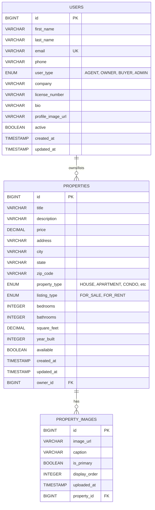

# Real Estate Database - Entity Relationship Diagram

## Visual ER Diagram



## Relationship Details

### 1️⃣ USER → PROPERTY (One-to-Many)

**Relationship**: One user can own or manage multiple properties

**Cardinality**: 1:N
- Minimum: 0 properties per user
- Maximum: Unlimited properties per user

**Implementation**:
```java
// User.java
@OneToMany(mappedBy = "owner", cascade = CascadeType.ALL, fetch = FetchType.LAZY)
private List<Property> properties = new ArrayList<>();

// Property.java
@ManyToOne(fetch = FetchType.LAZY)
@JoinColumn(name = "owner_id", nullable = true)
private User owner;
```

**Foreign Key**: `properties.owner_id` → `users.id`

**Cascade Behavior**: 
- ON DELETE SET NULL (property remains if user is deleted)

---

### 2️⃣ PROPERTY → PROPERTY_IMAGE (One-to-Many)

**Relationship**: One property can have multiple images

**Cardinality**: 1:N
- Minimum: 0 images per property
- Maximum: Unlimited images per property

**Implementation**:
```java
// Property.java
@OneToMany(mappedBy = "property", cascade = CascadeType.ALL, 
           orphanRemoval = true, fetch = FetchType.LAZY)
private List<PropertyImage> images = new ArrayList<>();

// PropertyImage.java
@ManyToOne(fetch = FetchType.LAZY)
@JoinColumn(name = "property_id", nullable = false)
private Property property;
```

**Foreign Key**: `property_images.property_id` → `properties.id`

**Cascade Behavior**: 
- ON DELETE CASCADE (images are deleted when property is deleted)
- Orphan Removal = TRUE (images deleted when removed from collection)

---

## Database Statistics

After initialization, the database contains:

| Entity | Count | Description |
|--------|-------|-------------|
| Users | 3 | 2 Agents, 1 Owner |
| Properties | 5 | Various types and locations |
| Property Images | 5+ | At least one per property |

## Index Strategy

**Performance Indexes Created**:

1. **Properties Table**:
   - `idx_city` - Fast filtering by city
   - `idx_property_type` - Fast filtering by type
   - `idx_listing_type` - Fast filtering by listing type
   - `idx_price` - Fast price range queries
   - `idx_property_owner` - Fast joins with users

2. **Users Table**:
   - `idx_user_email` - Fast email lookups
   - `idx_user_type` - Fast filtering by user type

3. **Property Images Table**:
   - `idx_image_property` - Fast joins with properties

## Query Examples

### Get Property with Owner and Images
```sql
SELECT 
    p.id, p.title, p.price, p.city,
    u.first_name, u.last_name, u.email,
    i.image_url, i.is_primary
FROM properties p
LEFT JOIN users u ON p.owner_id = u.id
LEFT JOIN property_images i ON p.id = i.property_id
WHERE p.id = 1
ORDER BY i.display_order;
```

### Get All Properties by Agent
```sql
SELECT p.*, u.first_name, u.last_name
FROM properties p
INNER JOIN users u ON p.owner_id = u.id
WHERE u.user_type = 'AGENT' 
  AND u.email = 'john.smith@realestate.com'
  AND p.available = true;
```

### Get Properties with Primary Image
```sql
SELECT 
    p.id, p.title, p.price, p.city,
    i.image_url as primary_image
FROM properties p
LEFT JOIN property_images i ON p.id = i.property_id AND i.is_primary = true
WHERE p.available = true
ORDER BY p.created_at DESC;
```

## Data Integrity Rules

1. **User Email**: Must be unique
2. **Property Price**: Must be greater than 0
3. **Property Owner**: Optional (can be NULL)
4. **Property Images**: Requires valid property_id
5. **Cascade Delete**: Images deleted when property deleted
6. **Orphan Removal**: Images removed from collection are deleted

## JPA Configuration

**application.properties settings**:
```properties
# Create tables from scratch on startup
spring.jpa.hibernate.ddl-auto=create-drop

# Show SQL queries in console
spring.jpa.show-sql=true

# Format SQL for readability
spring.jpa.properties.hibernate.format_sql=true

# Initialize sample data
spring.jpa.defer-datasource-initialization=true
```

## Access the Database

**H2 Console URL**: http://localhost:8080/h2-console

**Connection Settings**:
- Driver Class: `org.h2.Driver`
- JDBC URL: `jdbc:h2:mem:realestatedb`
- Username: `sa`
- Password: (leave empty)

---

**Generated by**: Real Estate Backend Application  
**Database**: H2 In-Memory Database  
**ORM**: Hibernate/JPA  
**Spring Boot Version**: 3.2.1
